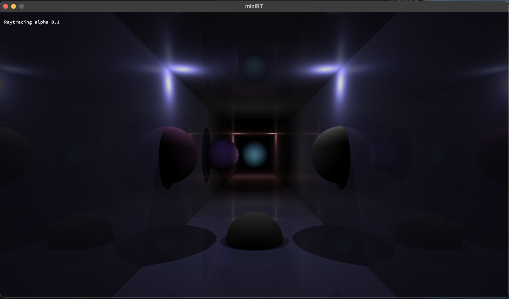

### MiniRT

<!--Thumbnail-->


## Index

- [MiniRT](#minirt)
  - [About](#About)
  - [Concepts](#Concepts)
  - [Features](#features)
  - [Installation](#installation)
  - [Screenshots](#screenshots)


## About

MiniRT is a small ray tracing project that aims to render simple 3D scenes. Ray tracing is a technique for generating an image by tracing the path of light as pixels in an image plane and simulating the effects of its encounters with virtual objects.

## Concepts

Ray tracing is a rendering technique that can produce incredibly realistic lighting effects and reflection. Essentially, an algorithm can trace the path that light takes and simulate the way that the light interacts with the objects it ultimately hits in the computer-generated world.

## Features

- Render simple 3D scenes
- Handle multiple light sources
- Handle multiple objects
- Handle shadows
- Handle reflections


## Installation

1. Clone the repository
```bash
  $> git clone https://github.com/PedroVMota/MiniRT.git
  $> cd MiniRT/
  #if you are on Linux
  $> make -C mlx_linux
  #if oy are on MacOS
  $> make -C minilbx_opengl
  $> make
  $> ./MiniRT {path_to_scene_file}.rt
```

### Scene File

The scene file is a simple text file that contains the description of the scene. The file must contain the following information
The scene must have a camera, an ambient light, and at least one object.

The file information must have the model identity and some information about each model. Eveything you need to know is bellow:

```bash
  # All the vector informaiton must be writen "x,y,z" the the vector orientation must be "x,y,z" in the range of -1 to 1
  # The color information must be written "R,G,B" in the range of 0 to 255
  # The specular values goes from 0 to 1000 and the reflection is 0 to 1

  # Camera:
  C 0,0,0 0,0,1 90

  # Sphere: origin, diameter, color and optional specular reflection
  # Mandatory:
    sp 0,2.3,20.0 10 255,0,0
  # Optional:
    sp 0,0,20 10 255,0,0 1000 0.8

  # Plane: origin, orientation, color and optional specular reflection checkerboard or any other predefined texture at the momment only
    # > checkerboard: 1
  # Mandatory:
    pl 0,0,0 0,0,1 255,255,255
  # Optional:
    pl 0,0,0 0,0,1 255,255,255 1000 0.8 1

  # Cylinder: origin, orientation, diameter, height, color and optional specular reflection
  # Mandatory:
    cy 0,0,0 0,0,1 2 5 0,255,0
  # Optional:
    cy 0,0,0 0,0,1 2 5 0,255,0 1000 0.8

  # Light source: origin, brightness, color
  # Mandatory:
    L 0,0,0 0.6 255,255,255
  
  # Ambient light: brightness, color
  # Mandatory:
    A 0.2 255,255,255
```
  if the scene is setup properly you should see a window 1280x720 with the rendered scene.
