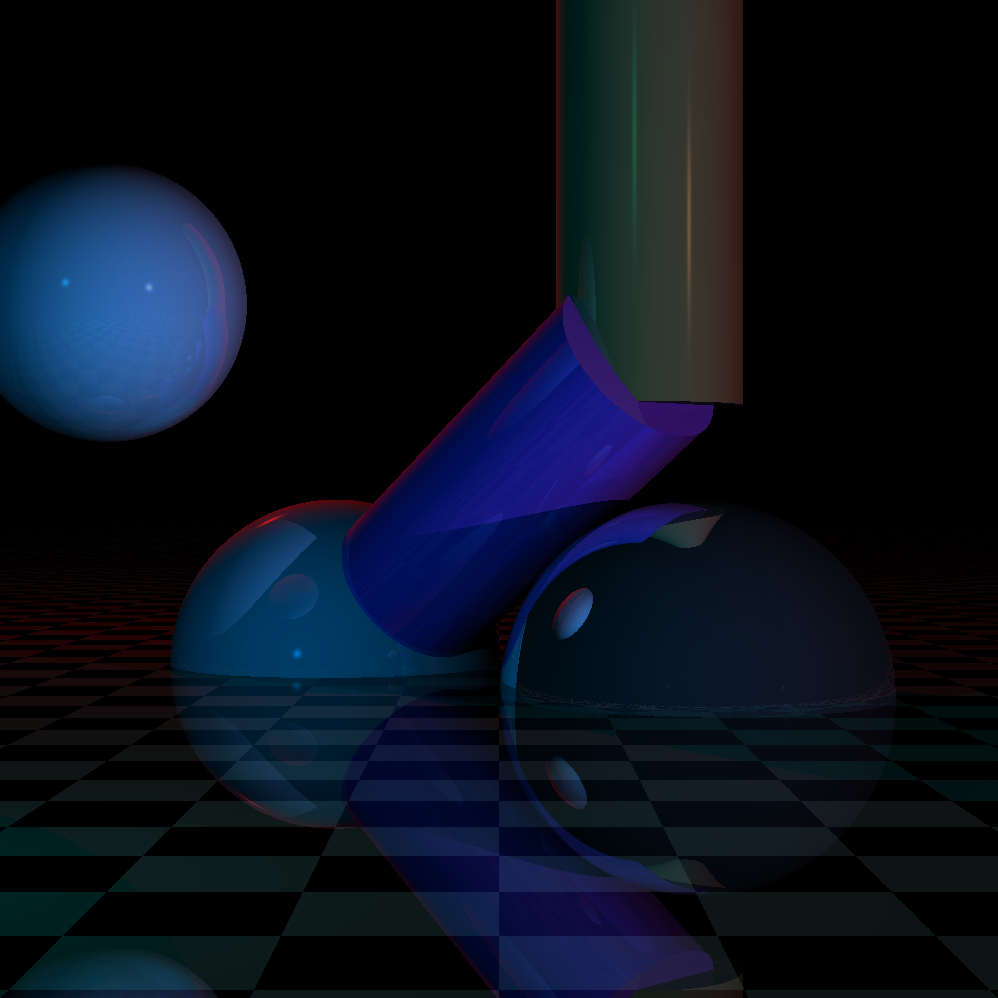
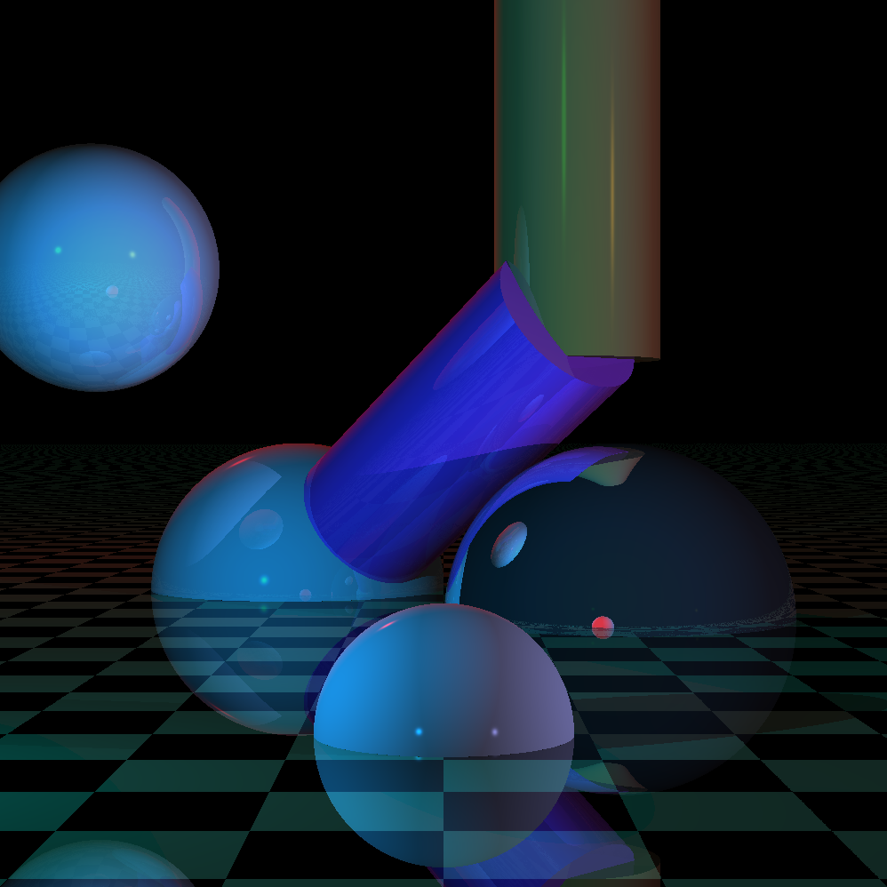
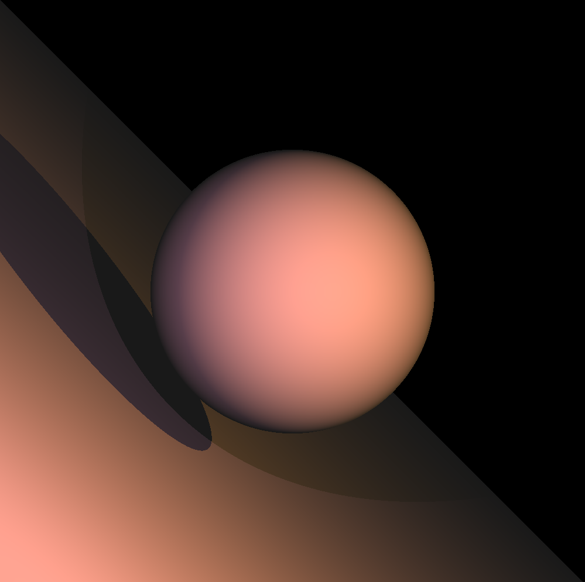
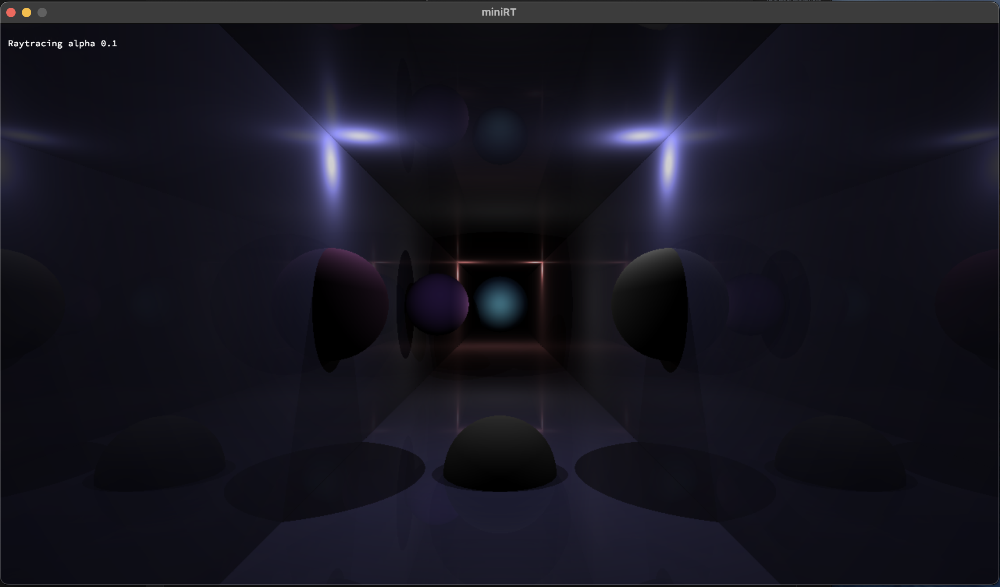

To create a grid of images at the start of your `README.md`, you can use HTML directly within the Markdown file. This approach allows you to control the layout more precisely. Below is an example of how you might structure the `README.md` to include a grid of images at the beginning:

---

# Mini RayTracing (MiniRT) Project

## Image Gallery

<div align="center">
  <table>
    <tr>
      <td></td>
      <td></td>
    </tr>
    <tr>
      <td></td>
      <td></td>
    </tr>
  </table>
</div>


## Brief Overview

The **Mini RayTracing (MiniRT)** project is a simple yet powerful application that serves as an introduction to the fundamentals of ray tracing. Developed in C, this project demonstrates how light interacts with objects in a 3D environment by simulating rays of light and their interactions with different surfaces.

This project was contributed by [Contributor's Name], and it has been further refined to include additional features and improvements to better illustrate the core concepts of ray tracing. The project is designed to be both educational and functional, providing a hands-on approach to learning computer graphics.

### Technologies Used
- **C Programming Language**: The core of the project, handling all logic, memory management, and interactions with the operating system.
- **MiniLibX**: A lightweight graphics library included in the repository, used for rendering images, handling input events, and managing window operations. MiniLibX is essential for creating the graphical output of the ray tracing.
- **Mathematics**: The project relies heavily on linear algebra, including vector and matrix operations, to perform calculations necessary for ray tracing.

## Project Difficulty

The MiniRT project is of moderate difficulty, requiring a solid understanding of the following areas:
- **C Programming**: Proficiency in memory management, pointers, and data structures is essential.
- **Mathematics**: A good grasp of linear algebra, especially vector operations and geometry, is necessary to implement the ray tracing algorithms.
- **Graphics Programming**: Basic knowledge of rendering pipelines, image buffers, and graphical libraries like MiniLibX is beneficial.

This project is an excellent way to deepen your understanding of computer graphics, providing practical experience with the concepts behind 3D rendering and image synthesis.

## The Mathematics Behind MiniRT

### Ray Casting
Ray casting is the foundational technique used in this project. Each pixel on the screen corresponds to a ray projected from the camera into the scene. The goal is to determine whether this ray intersects with any objects in the scene. If an intersection is found, the color of the corresponding pixel is calculated based on the material properties of the object and the lighting conditions.

### Vector Mathematics
- **Vectors and Points**: Vectors are used to represent directions and points in 3D space. Operations such as addition, subtraction, and scaling are performed to calculate positions and directions.
- **Dot Product**: This operation is used to calculate angles between vectors, which is crucial for determining lighting effects such as diffuse and specular reflections.
- **Cross Product**: Used to find perpendicular vectors, which is important for calculating normals to surfaces.
- **Reflection and Refraction**: The project implements basic reflection models to simulate the way light bounces off surfaces.

### Intersections
For each ray, the project calculates potential intersections with various geometric shapes (spheres, planes, cylinders). The intersection closest to the camera is used to determine the color and shading of the pixel. The mathematical computations involve solving equations for each geometric shape and determining the point of intersection.

## User Guide

### Installation

Since the repository includes MiniLibX, you don't need to install it separately. To get started with the MiniRT project, follow these steps:

1. **Clone the MiniRT Repository**:
    ```bash
    git clone https://github.com/yourusername/minirt.git
    cd minirt
    ```

2. **Compile the Project**:
   - The project includes a `Makefile` that handles the compilation process. Simply run:
     ```bash
     make
     ```

This command will compile the MiniRT project and produce the executable needed to run the ray tracer.

### Running the Application

To run the MiniRT application, use the following command:
```bash
./minirt scenes/your_scene_file.rt
```
This command will open a window where the 3D scene described in the `your_scene_file.rt` file will be rendered. You can create or modify `.rt` files to describe different scenes.

### Exiting the Application

You can exit the application by closing the window or pressing the `ESC` key. This will terminate the program and close the rendering window.

## Available Commands

In the MiniRT application, you can interact with the scene using the following controls (assuming they are implemented):
- **Move Camera**: Use the arrow keys or WASD keys to move the camera within the scene.
- **Zoom In/Out**: Use specific keys (e.g., `+` and `-`) to zoom in and out.
- **Rotate Camera**: Use keys like `Q` and `E` to rotate the camera view.
- **Toggle Lights**: Use designated keys to toggle different light sources in the scene.
- **Exit**: Press `ESC` to exit the application.

## Conclusion

The MiniRT project is an educational tool designed to provide a hands-on experience with ray tracing and 3D rendering. By completing this project, you will gain valuable insights into how graphics are rendered and how light interacts with objects in a virtual environment. This project serves as an excellent introduction to the field of computer graphics and will prepare you for more advanced topics in rendering and visualization.

---

### Notes:
- Replace `path_to_your_image1.png`, `path_to_your_image2.png`, etc., with the actual paths to your images.
- You can adjust the `width` of the images to fit your needs. In the example above, each image is set to `250` pixels wide, but you can modify this value as needed.
- The table is centered using `<div align="center">` to make it look neat in the `README.md`.

This grid layout will visually showcase multiple images at the start of your `README.md`, providing an immediate and engaging overview of your project’s capabilities.